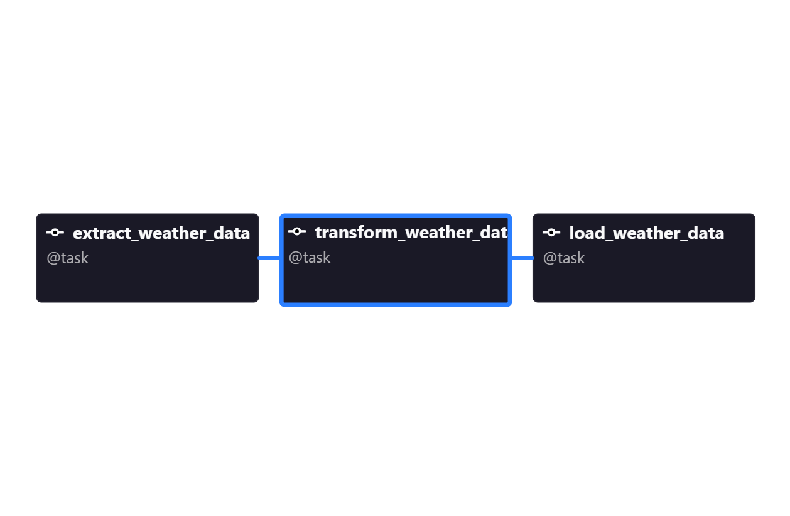

# Weather ETL Pipeline using Apache Airflow

## Tech Stack
- Apache Airflow
- Astro CLI
- Docker
- PostgreSQL
- Python
- Open-Meteo API

## Pipeline Flow
Extract → Transform → Load

## Features
- Fetches live weather data
- Transforms API response
- Stores data into PostgreSQL
- Scheduled DAG execution using Airflow

## DAG Preview
(Add your DAG screenshot here)

## Learning Outcomes
- Airflow DAGs
- TaskFlow API
- Airflow Connections
- Docker debugging
- PostgreSQL integration
- ETL orchestration